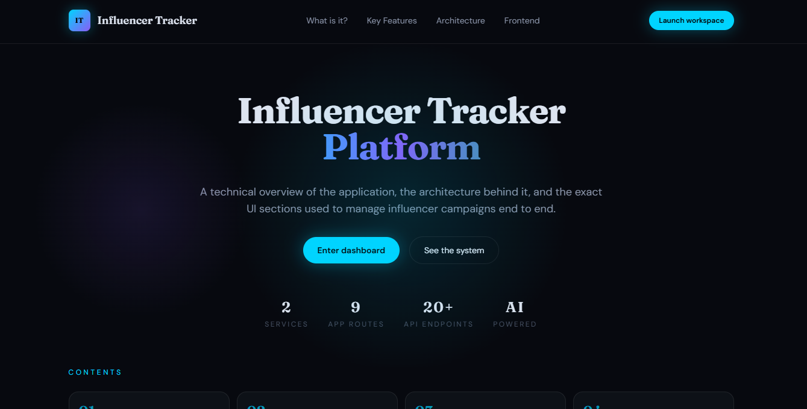

# Influencer Tracker Frontend

A Next.js 14 (App Router) frontend for managing influencer campaigns, performance analytics, and AI-assisted creative tooling. The UI focuses on a real-time dashboard, campaign operations, and influencer intelligence.



## Deployment
- Vercel deployment: `influencer-tracker-frontend-lc7u09zat-yashnarkhedkars-projects.vercel.app`
- Backend deployment: Vercel (as provided for this project)

## Features
- Landing page with product overview and onboarding entry points.
- Dashboard KPIs, charts, and AI insights.
- Campaign management: list, create, view, edit.
- Influencer management: list, create, view, refresh stats.
- AI utilities for brief generation and title/hashtag suggestions.

## Tech Stack
- Next.js 14 + React 18 (App Router)
- TypeScript
- Tailwind CSS
- React Query (TanStack)
- Axios
- Recharts
- Radix UI
- Lucide Icons
- Vercel (deployment)

## Requirements
- Node.js 18.17+ (recommended for Next.js 14)
- npm (or your preferred package manager)

## Getting Started
1. Install dependencies:

```bash
npm install
```

2. Configure environment variables:

Create a `.env.local` file in the project root:

```bash
NEXT_PUBLIC_API_BASE_URL=https://influencer-tracker-frontend-lc7u09zat-yashnarkhedkars-projects.vercel.app
```

3. Start the dev server:

```bash
npm run dev
```

The app will be available at `https://influencer-tracker-frontend-lc7u09zat-yashnarkhedkars-projects.vercel.app`.

## Scripts
- `npm run dev` - Start the development server
- `npm run build` - Build for production
- `npm run start` - Start the production server
- `npm run lint` - Run ESLint

## App Routes
- `/` - Marketing/landing page
- `/dashboard` - Performance overview and analytics
- `/campaigns` - Campaign list
- `/campaigns/new` - Create campaign
- `/campaigns/[id]` - Campaign details
- `/campaigns/[id]/edit` - Edit campaign
- `/influencers` - Influencer list
- `/influencers/new` - Create influencer
- `/influencers/[id]` - Influencer details

## API Notes
The frontend expects a backend that exposes these key endpoints (relative to `NEXT_PUBLIC_API_BASE_URL`):
- `/dashboard/*` for summary metrics and chart data
- `/campaigns/*` for campaign CRUD
- `/influencers/*` for influencer CRUD and stats refresh
- `/ai/*` for AI briefing and suggestions

See `lib/api.ts` for the full set of API calls.

## Project Structure
- `app/` - Next.js App Router pages and layouts
- `components/` - UI and feature components
- `hooks/` - React Query hooks
- `lib/` - API client, types, formatting utilities
- `tailwind.config.ts` - Tailwind theme configuration

## Frontend Details
- Dashboard: KPI cards, donut/bar/line/pie charts, and AI insights panel with manual refresh.
- Campaigns: filterable table, detail view with assignments, and edit/create flows.
- Influencers: card grid, detail view with campaign assignments, and stats refresh.
- Loading states: skeletons mirror real UI structure for faster perceived performance.
- Manual refresh: explicit refresh buttons for dashboard, campaigns, and influencers.

## Best Practices Applied
- Centralized data fetching with React Query hooks.
- Disabled refetch-on-focus to reduce unnecessary backend load.
- Manual refresh actions to control network traffic.
- Consistent skeleton states that match content layout.
- Reusable UI primitives (cards, buttons, dialogs, selects).
- Typed API and UI data using shared TypeScript models.

## Future Enhancements
1. Optimistic updates for campaign/influencer mutations.
2. Pagination, search, and advanced filters for campaigns/influencers.
3. Role-based access control and audit logging in the UI.
4. Offline-friendly caching with background sync and stale-while-revalidate.
5. Export reports (CSV/PDF) for campaigns and influencer performance.
6. Real-time updates with WebSockets/SSE for live dashboards.

## Notes
- This is a frontend-only repo; it requires a compatible backend API to power data.
- All API calls are performed client-side using React Query and Axios.
